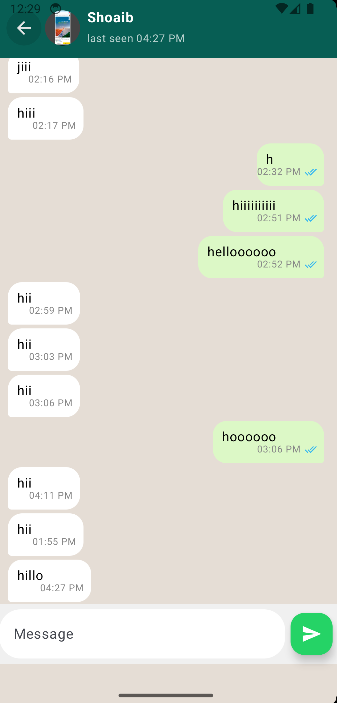
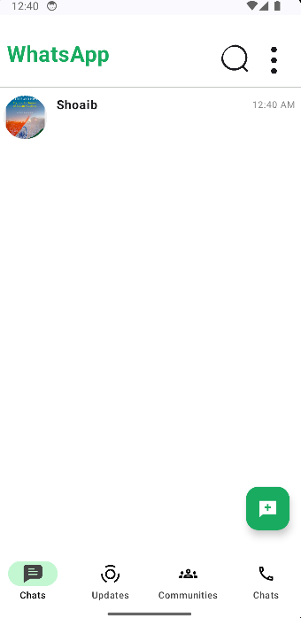
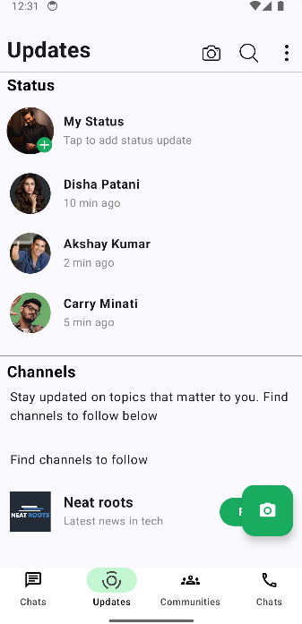
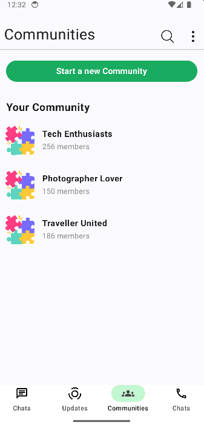

# 💬 WhatsApp Clone – Android App (Jetpack Compose)

A modern **WhatsApp Clone Android application** built using **Jetpack Compose** for UI, **Kotlin** for application logic, and **Firebase** for backend services.  
The app replicates the core user experience of WhatsApp, including chats, status updates, communities, and real-time messaging.

---

## 📖 Project Overview

This project simulates a real-world messaging application similar to WhatsApp while following **modern Android development best practices**.

The primary goals of this project are:
- Declarative UI development using **Jetpack Compose**
- Real-time messaging using **Firebase**
- Clean, maintainable, and scalable architecture
- Smooth and responsive user experience

This application demonstrates how modern Android apps are built using **Compose + Firebase**, replacing traditional XML-based UI development.

---

## ✨ Features

### 🔹 Chats
- One-to-one real-time messaging
- WhatsApp-style sender & receiver chat bubbles
- Message timestamps
- Online / last seen status (UI level)
- Floating action button to start new chats

### 🔹 Updates (Status)
- View status updates from contacts
- Time-based status display
- Channels section similar to WhatsApp
- Floating action button to add a new status

### 🔹 Communities
- View joined communities
- Create new communities
- Community listing with member count
- Clean and organized UI

### 🔹 UI & Navigation
- Bottom navigation bar (Chats, Updates, Communities, Calls)
- Material 3 design principles
- Responsive layouts for multiple screen sizes
- Smooth animations and transitions

---

## 📱 App Screenshots

  
  
  
  

  <b>Chats</b> &nbsp;&nbsp;&nbsp; 
  <b>Chat Screen</b> &nbsp;&nbsp;&nbsp; 
  <b>Updates</b> &nbsp;&nbsp;&nbsp; 
  <b>Communities</b>

---

## 🛠 Technology Stack

### 🔹 Frontend
- **Language:** Kotlin
- **UI Framework:** Jetpack Compose
- **Design System:** Material 3
- **State Management:** State, MutableState, ViewModel

### 🔹 Architecture
- MVVM (Model–View–ViewModel)
- Unidirectional data flow
- Clear separation of concerns

### 🔹 Backend
- **Firebase**
  - Firebase Authentication
  - Firebase Firestore / Realtime Database
  - Real-time data synchronization

### 🔹 Build System
- Gradle
- Kotlin DSL (`.kts`)

---
